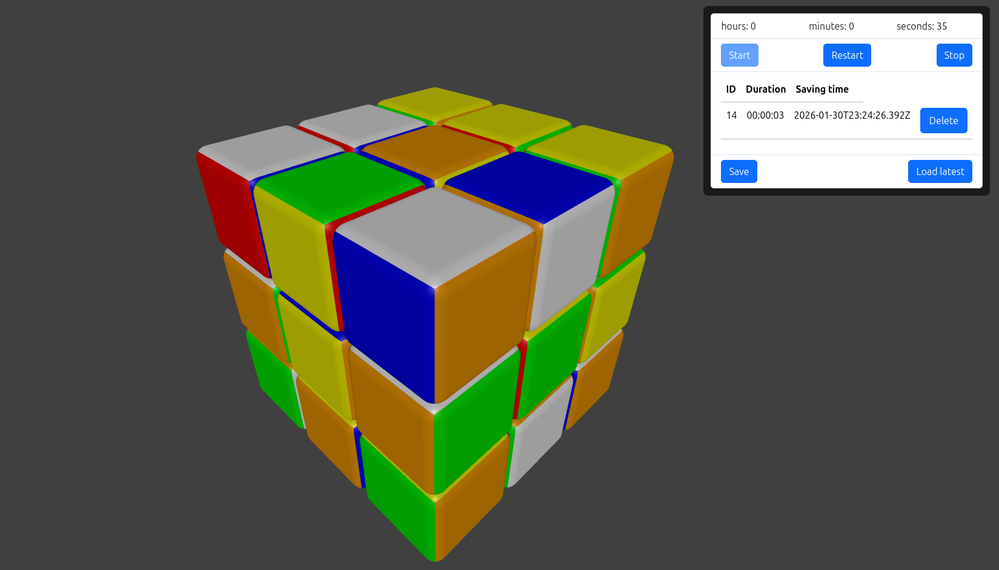
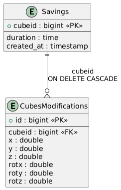

# 🧊 Rubik’s Cube 3D Web App

An interactive **3D Rubik’s Cube web application** built with modern web technologies.  
The app allows users to rotate a Rubik’s Cube in real time, track solving time, and save, load, or delete cube states using a persistent backend.

The project focuses on combining **real-time 3D graphics** with a full-stack architecture.



---

## ✨ Features

- Interactive 3D Rubik’s Cube rendered in the browser
- Free cube rotation and manipulation
- Built-in timer
- Save the current cube state via a button
- Display saved states in a table
- Load a saved state by clicking a table row
- Delete a saved state using a dedicated button
- Frontend and backend stay fully synchronized

---

## 🛠 Tech Stack

### Frontend

- **React**
- **Three.js** — rendering and controlling the 3D Rubik’s Cube
- Vite
- HTML / CSS

### Backend

- **Node.js**
- **Express**
- **PostgreSQL**

The backend stores:

- cube save metadata (solve time, creation date)
- full cube state data (positions and rotations of cube parts)

---

## 🗄 Database

The application uses **PostgreSQL**.

Main tables:

- `savings` — stores cube saves and timing information
- `cubesmodifications` — stores cube element positions and rotations

The tables are linked via foreign keys with `ON DELETE CASCADE`, ensuring data consistency when a save is deleted.



---

## 🧩 Architecture Overview

- The **frontend** manages UI, user interactions, and the 3D scene
- The **backend** exposes a REST API for saving, loading, and deleting cube states
- 3D logic (scene, renderer, cube transformations) is separated from UI logic
- State updates are immediately reflected in the UI after backend operations

---

## ▶️ Main commands

All commands are defined in the **`package.json`** file.

### Install dependencies

```bash
npm install
```

### Run only frontend part

```bash
npm run dev:ui
```

### Build application

```bash
npm run build
```

### Run backend part too

```bash
npm start
```

### Run backend with nodemon

```bash
npm start
```

## 📝 TODO

- **Code refactoring!**
- Add a cube solved event
- Add support for larger cube sizes
